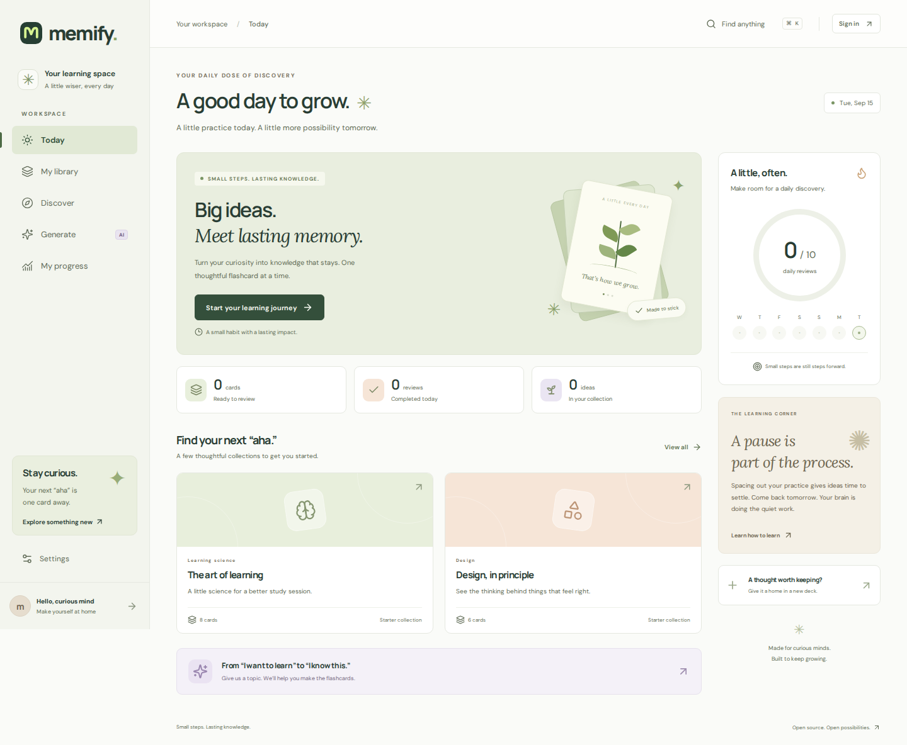

# Memify

**A little practice. A lasting memory.**

Memify is a calm, self-hostable learning workspace built with React, TypeScript, Vite, Express, and SQLite. The learning app is open source; the optional hosted generation service is independently operated and proprietary.



## What works

- Email/password accounts, guided onboarding, verification, password resets, secure cookie sessions.
- Private decks, editable question/answer cards, reverse-card and fill-in-the-blank helpers, JSON deck import/export, full account export and deletion.
- Due-card reviews with a transparent SM-2-inspired scheduler, keyboard controls, and typed-recall quizzes.
- Original starter collections, searchable library, daily goals, activity history, and progress.
- A shared deck library: publish your own collections, one-vote-per-account upvoting, category filters and top/new/trending ranking, seeded with starter content.
- Study tools that float over any page — a resizable notepad with autosaving tabs, a Pomodoro timer, and synthesised focus sound — with their layout remembered per account.
- Memify Pro (₹299/month, ₹1,200/6 months, ₹2,000/year) lifts the free ceilings: unlimited AI sets of up to 100 cards, unlimited decks, three note tabs, publishing, and every timer preset and sound.
- Optional cloud integration: AI-generated sets, preview/edit before saving, and Stripe Checkout.
- Responsive layouts, native keyboard-trapped dialogs, reduced-motion support, self-hosted fonts, and no analytics or tracking scripts.

## Start locally

Requires Node.js 22.13+ and npm. SQLite needs a writable local disk.

```sh
npm ci
cp .env.example .env
npm run dev
```

Open **http://localhost:5173**. The API runs on port 3001. A new account receives a starter deck. During local development, verification/reset links appear in the server console and relevant account screens; no SMTP credentials are needed. Never enable development mode in production.

Manual deck creation, study, quizzes, and progress work without Memify Cloud. No AI responses or payment confirmations are simulated.

## Optional cloud connection

Set `CLOUD_URL` and `CLOUD_SHARED_SECRET` on the learning server. The private service must use the same secret and `APP_ORIGIN`. Restart after environment changes. Never prefix secrets with `VITE_`: those values are public browser configuration.

The cloud interface is documented in [docs/CLOUD_API.md](docs/CLOUD_API.md). Self-hosters may implement their own compatible service. The private service’s prompts, billing implementation, and provider credentials are not part of this repository.

## Verify

```sh
npm run check
npx playwright install chromium
npm run test:e2e
```

Browser tests use an isolated in-memory database and the production build; run `npm run build` first if invoking them separately. API tests cover account isolation, reset-token reuse, request origins, transactional edits, and review retry handling.

## Production

See [deployment](docs/DEPLOYMENT.md), [architecture](docs/ARCHITECTURE.md), and [release checklist](docs/RELEASE.md). This code is a v1 implementation, not a claim that an unconfigured deployment is ready to accept real users or payments. Live SMTP, provider generation, Stripe test/live webhooks, backup restoration, and operational configuration must be validated in the target environment.

Scope: text question/answer cards and self-assessed recall quizzes. Anki `.apkg` import, media cards, native mobile apps, offline sync, and automatic answer grading are not included in this release. The floating study tools assume a pointer and are hidden below 760px. Subscription checkout requires the optional cloud service; without it the plan UI explains that billing is not connected rather than simulating a purchase.

## Contribute

Read [CONTRIBUTING.md](CONTRIBUTING.md) and [SECURITY.md](SECURITY.md). Please keep the manual learning experience independently useful. Do not submit private service code, credentials, or user data.

## License

[GNU AGPL-3.0](LICENSE). Original starter collection text is included under the same license. Fonts retain their bundled SIL Open Font License; third-party packages retain their respective licenses. The Memify name and branding are not licensed as trademarks by this software license.
